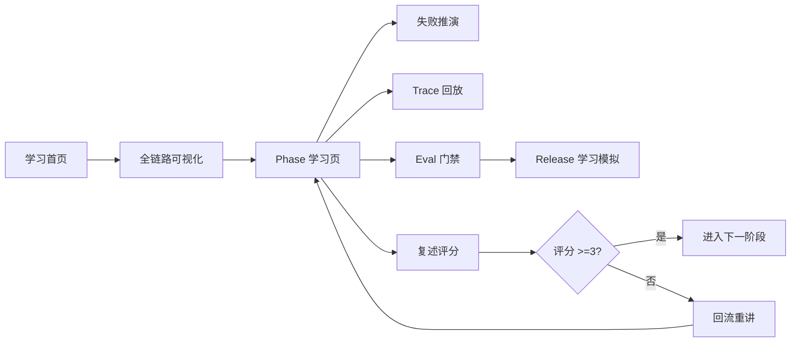

# 教学过程可视化蓝图

## 1. 教学过程要被可视化成什么

不是把文档搬到网页上，而是把每一课的学习动作变成可见工作流。

```text
读问题
-> 看事故
-> 看负责层
-> 看受控链路
-> 看失败路径
-> 做复述
-> 得到评分
-> 进入下一阶段或回流重讲
```

## 2. 核心工作流

### 2.1 冷启动学习

用户进入后只看到 Phase 0.1：

```text
客户退款工单
-> 模型建议退款
-> ToolCall 只是申请
-> Policy 决定 allow/deny/approval
-> Audit 记录决策证据
-> 用户复述为什么建议和执行必须分开
```

可视化重点：

- 主路径只显示一个故事。
- 不展示所有 Phase。
- 不展示 GitHub 资料库。
- 不展示真实生产指标。

### 2.2 阶段学习循环

每个 Phase 的界面结构固定：

```text
本阶段问题
-> 防什么失控
-> 系统边界
-> 设计产物
-> 坏设计案例
-> 复述卡
-> 进入下一阶段条件
```

通过标准：

- 设计卡存在。
- 失败样例存在。
- 评审问题至少 3 个。
- 复述评分 >=3。

### 2.3 失败推演

失败不是附录，而是学习入口。

| 事故 | 可视化方式 | 学到什么 |
|---|---|---|
| 重复退款 | retry 时间线 + operation_id 缺失 | 长线任务必须幂等 |
| 越权工具 | ToolCall 绕过 Policy 的红色路径 | prompt 不能决定权限 |
| 记忆污染 | 错误事实进入长期记忆 | 记忆写入必须有门禁 |
| 无 trace | 事故链路断点 | 可观测性不是日志装饰 |
| eval 降级 | 门禁被误放行 | 评测集也是发布资产 |

### 2.4 复述评分

复述不是文本框装饰，而是进入下一阶段的门禁。

评分必须记录：

- 分数：0-5。
- 用户答案。
- 是否包含事故。
- 是否包含负责层。
- 是否包含验收证据。
- 卡点标签。
- 回流动作。

## 3. 页面关系



## 4. 信息架构

一级导航：

- 今日学习
- 全链路
- 阶段
- 失败
- Trace
- Eval
- Release
- 证据

右侧固定证据面板：

- 当前事故
- 负责层
- source_files
- mock 数据
- 复述题
- 通过标准

## 5. 可持续迭代机制

每次学习都会产生可回流数据：

```text
低分复述
-> Concept 修订
-> FailureCase 增补
-> RestatementCard 重写
-> EvalCase 增补
-> 下一版页面更新
```

这让前端不是一次性展示页，而是持续帮助学习的系统。

## 6. 中文优先双语显示规则

页面默认中文显示，英文只作为关键术语锚点。

示例：

| 页面位置 | 推荐显示 |
|---|---|
| 顶部状态 | 学习模式 Learning mode / 模拟数据 Mock data / 不执行真实操作 No real execution |
| 节点 | 策略 Policy、运行时 Runtime、检索增强 RAG |
| 按钮 | 查看受控链路、比较坏设计路径、记录复述评分 |
| 复述题 | 为什么 RAG 检索结果不能直接可信？ |

如果生成图或原型主要是英文，必须回到视觉方向阶段重做中文化。
