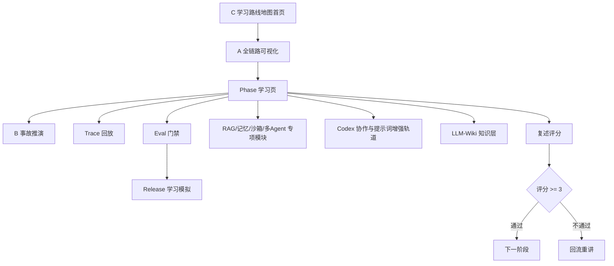

# 前端可视化实施 PRD

版本：v0.2 Open Design  
日期：2026-07-02  
状态：前端设计准备完成，已采用 C/A/B 组合视觉路线  
源码状态：未创建前端工程  

## 1. 目标

构建一个可持续迭代的学习可视化前端，让用户不用写代码，也能通过交互式教学理解工业级 Agent 的完整设计链路。

它要把教学过程可视化为：

```text
阶段问题
-> 事故样例
-> 负责层
-> 受控链路
-> 失败路径
-> 证据
-> 复述评分
-> 下一阶段或回流重讲
```

## 2. 设计方式声明

本项目采用：

```text
Product Design 插件作为设计流程门禁
Open Design 本地文档作为权威设计包
前端 skill 作为后续 shape/prototype/QA 工具
Implementation-later 再进入代码实现
```

原因：

- Product Design 能约束 brief、视觉方向和原型节奏。
- Open Design 文档适合长期维护和教学复盘。
- 前端 skill 需要 `PRODUCT.md` 和 `DESIGN.md` 才能保持风格一致。
- 当前目标仍是学习可视化，不是生产系统。

## 3. 范围

MVP 做：

- 学习首页。
- 全链路可视化。
- Phase 学习页。
- 失败推演。
- Trace 回放。
- Eval 门禁。
- Release 学习模拟。
- 复述评分。

MVP 不做：

- 真实登录。
- 真实数据库。
- 真实工具调用。
- 真实生产发布。
- 真实企业数据。
- 权限后台。
- workflow builder。

## 3.1 语言与本地化范围

MVP 默认做中文优先双语版本。

| 文案区域 | 默认语言 | 规则 |
|---|---|---|
| 导航 | 中文 | 英文不常驻，避免噪声 |
| 按钮 | 中文 | 使用动作 + 对象 |
| 架构节点 | 中文 + 英文短标签 | 例如“策略 Policy” |
| 教学说明 | 中文 | 首次出现术语时括注英文 |
| RAG/Agent 术语表 | 中英双语 | 帮助读官方资料 |
| schema 字段 | 英文 | 保持工程一致性 |
| 复述卡 | 中文 | 用户用中文回答即可 |
| source_files | 原文件路径 | 不翻译路径和文件名 |

必须中文化的边界提示：

```text
学习模式 Learning mode
模拟数据 Mock data
不执行真实操作 No real execution
来源文件 Source files
```

不允许把主要按钮写成全英文。英文只作为术语锚点或工程字段。

## 4. 用户故事

### 4.1 半懂学习者

作为半懂学习者，我要从一个退款工单进入，而不是先读一堆术语，这样我能先建立第一张系统图。

验收：

- 30 秒内知道当前 Phase。
- 能说出今天只学什么。
- 不会把页面误认为生产系统。

### 4.2 不写代码学习者

作为不写代码学习者，我要通过点选链路、看失败路径和复述评分，知道一个 Agent 设计是否工业级。

验收：

- 能指出建议和执行为什么分离。
- 能指出 Tool Gateway、Policy、Audit 的职责。
- 能说出至少一个事故和一个拦截证据。

### 4.3 Codex 协作者

作为 Codex 协作者，我要把 Design-only 产物转成后续工程任务和验收门禁。

验收：

- 每个页面能追溯到 PRD 小节。
- 每个 mock 数据对象能映射到后续 schema。
- 每个阶段能产生 Implementation-later backlog。

## 5. 信息架构



### 5.1 C/A/B 组合路线

前端不再等待用户在 A/B/C 中三选一。当前推荐路线已经确定：

```text
C 学习路线地图作为首页和阶段导航
-> A 分层控制台作为全链路学习页
-> B 事故推演工作台作为失败案例和低分回流页
```

这个组合比单一方向更符合教学目标：先知道自己在哪一步，再看懂系统边界，最后从事故反推拦截层和证据。

### 5.2 必须覆盖的教学专题

| 专题 | UI 形态 | 对应课程 |
|---|---|---|
| Agent 网关与工具治理 | A 分层控制台 | Phase 3 |
| 长线任务与断点恢复 | 时间线 / checkpoint lane | Phase 4 |
| RAG 问题诊断与优化 | 问题标签 -> 诊断 -> 策略 -> eval case | Phase 1/3/5/7/8/9/11 |
| 记忆系统 | 记忆生命周期泳道 | Phase 6 |
| 测评审核 | Eval 门禁矩阵 | Phase 7 |
| 安全隔离 | 工具风险矩阵 + sandbox profile | Phase 9 |
| 多 Agent 协同 | planner/executor/reviewer/verifier handoff 图 | Phase 10 |
| 治理发布 | release packet + rollback checklist | Phase 11 |
| Codex 协作 | 原始问题 -> 增强提示词 -> subagent 任务卡 -> 主线程整合 | 全阶段 |
| LLM-Wiki 知识层 | 来源审核 -> 知识卡 -> 版本记录 -> 低分回流 | Phase 5/7/8/11 |

## 6. 前端技术栈

MVP：

| 层 | 技术 |
|---|---|
| App | Next.js App Router |
| Language | TypeScript |
| Styling | Tailwind CSS |
| UI | shadcn/ui |
| Icons | lucide-react |
| Graph | React Flow |
| State | Zustand |
| Charts | Recharts |
| Content | MDX + local JSON |
| Tests | Vitest + Playwright |

MVP 数据策略：

- 本地 JSON。
- mock run。
- mock trace。
- mock eval cases。
- mock release packet。
- source_files 指向课程文档。

## 7. 后端扩展

Implementation-later 才接后端：

```text
Next.js frontend
-> BFF/API routes
-> FastAPI Runtime Gateway demo/sandbox
-> SQLite/PostgreSQL
-> Trace/Audit store
-> Eval runner
```

后端接入前置条件：

- PRD、线框、视觉方向、学习验证都通过。
- trace/audit/eval/policy/tool registry schema 稳定。
- release、license、安全公告、维护状态已复核。
- 不需要真实凭据或真实写操作。

## 8. 设计系统

默认风格：

- 安静。
- 可信。
- 可扫描。
- 学习导向。
- 工业控制台。

布局：

- 左侧 Phase rail。
- 中央视觉工作区。
- 右侧 Evidence panel。
- 底部 Reflection strip。

组件：

- PhaseRail。
- FlowCanvas。
- EvidencePanel。
- RestatementCard。
- FailureCaseList。
- TraceTimeline。
- EvalGateTable。
- ReleasePacketView。
- GateDecisionBanner。
- RAGProblemLens。
- LLMWikiKnowledgeLayer。
- KnowledgeSourcePanel。
- SourceReviewQueue。
- KnowledgeVersionDiff。
- MemoryLifecycleLane。
- SandboxRiskSelector。
- MultiAgentHandoffMap。
- PromptEnhancementPanel。
- SubagentTaskCard。
- LearningBacklogBoard。

### 8.1 高级感 Product Design 标准

高级感不是装饰，而是成熟学习产品的清晰度和克制。

必须满足：

- 首页用 C 的路线地图建立学习位置感，不做营销 hero。
- 链路页用 A 的分层控制台建立系统边界，不做泛 dashboard。
- 事故页用 B 的事故推演建立失败路径，不一次塞满所有事故。
- 所有状态同时使用颜色、文字和图标。
- 所有主要按钮使用中文动作，例如“查看受控链路”“判断是否阻塞”“记录复述评分”。
- 所有页面保留 mock 边界提示。
- 所有低分都能进入回流队列。

## 9. 验收标准

### 9.1 学习验收

- 复述评分 >=3。
- 复述必须包含事故、负责层、验收证据。
- Phase 0.1、2、3、4、6、7、8、9、10 必须先完成学习验证。
- RAG 诊断器必须至少覆盖“找不到、找错租户、引用不可信”三类问题的看图前后评分。

### 9.2 设计验收

- 每页都有中文优先双语边界提示：学习模式 Learning mode、模拟数据 Mock data、不执行真实操作 No real execution、来源文件 Source files。
- 不出现真实生产按钮。
- 不出现营销 hero。
- 不出现装饰性卡片墙。
- 状态不能只靠颜色表达。
- 主要导航、按钮、复述题必须是中文。

### 9.3 技术验收

仅 Implementation-later 适用：

- TypeScript 类型通过。
- lint 通过。
- 桌面和移动端不溢出。
- React Flow 节点可点击。
- mock 数据可替换。
- 无真实凭据。
- 无真实生产工具调用。

## 10. 迭代机制

每一轮学习结束后，把低分复述回流：

```text
low score
-> concept fix
-> failure case update
-> restatement card rewrite
-> eval case add
-> visual page update
```

### 10.1 学习数据对象

每次学习至少记录：

```json
{
  "learning_session_id": "mock_session_001",
  "phase": "phase-03",
  "topic": "Gateway / Policy / RAG boundary",
  "question": "为什么 RAG 检索到的内容不能直接当成可信事实？",
  "answer_language": "zh-CN",
  "restatement_score": 2,
  "missing_parts": ["responsible_layer", "evidence"],
  "misconception_tags": ["rag_is_truth", "policy_boundary_unclear"],
  "feedback_action": "rewrite_concept_and_add_failure_case",
  "next_review_at": "next_session"
}
```

### 10.1.1 Prompt / Subagent 数据对象

每个 Phase 必须能展示一次“如何指挥 Codex”的教学样例：

```json
{
  "enhanced_prompt_id": "enhanced_prompt_phase_06_memory_001",
  "raw_user_question": "继续讲记忆系统",
  "enhanced_prompt": "请用 Design-only 方式讲 Phase 6 记忆系统，包含事故、负责层、验收证据、复述题和低分回流。",
  "recommended_subagent": "reviewer",
  "permission_scope": "read_only",
  "expected_evidence": ["source_file", "risk", "confidence"],
  "stop_condition": "找到 P0/P1 缺口后停止",
  "merge_rule": "按证据合并，不按投票合并"
}
```

### 10.1.2 RAG 诊断数据对象

RAG 页面必须按问题诊断，而不是只展示检索结果：

```json
{
  "rag_diagnostic_id": "rag_diagnostic_cross_tenant_001",
  "problem_label": "找错租户",
  "symptom": "检索命中其他租户文档",
  "diagnostic_metrics": ["tenant_acl_violation_rate", "forbidden_citation_count"],
  "optimization_options": ["tenant-scoped index", "policy filter before retrieval", "citation tenant check"],
  "eval_case_id": "eval_cross_tenant_retrieval",
  "release_blocking": true,
  "responsible_layers": ["Policy", "Tool Gateway", "RAG"]
}
```

### 10.1.3 长线任务可靠性对象

Phase 4 和 Eval 门禁页必须能展示：

```json
{
  "metric_id": "long_task_retry_idempotency_001",
  "metric_name": "重复副作用率",
  "target": "0 duplicate side effects in regression set",
  "failure_case": "retry 重复退款",
  "release_blocking": true,
  "related_eval_cases": ["eval_retry_duplicate_refund", "eval_checkpoint_resume_correctness"]
}
```

### 10.1.4 LLM-Wiki 知识层对象

知识层页面必须能展示来源、审核、知识卡、版本和回流队列：

```json
{
  "knowledge_source_id": "source_karpathy_llm_wiki_gist_20260702",
  "title": "LLM Wiki Pattern",
  "url": "https://gist.github.com/karpathy/442a6bf555914893e9891c11519de94f",
  "license_status": "needs_review",
  "adoption_mode": "pattern_only",
  "review_status": "needs_review",
  "fetched_at": "2026-07-02",
  "reviewed_at": "2026-07-02",
  "source_files": ["10-GitHub项目调研/LLM-Wiki知识层调研-2026-07-02.md"],
  "knowledge_topic": {
    "topic_id": "topic_knowledge_governance",
    "display_name_zh": "知识治理",
    "canonical_name_en": "Knowledge Governance",
    "phase": "phase-07",
    "layer": "Governance"
  },
  "knowledge_card": {
    "card_id": "card_knowledge_card_is_not_truth_001",
    "title_zh": "知识卡不是事实本身",
    "review_status": "needs_review",
    "confidence_score": 0.84,
    "rag_failure_modes": ["untrusted_citation", "stale_knowledge"]
  },
  "import_queue_status": "needs_source_review",
  "feedback_targets": ["Concept", "RAGDiagnostic", "EvalCase", "RestatementCard"]
}
```

LLM-Wiki 知识层对象必须保持中文可读、字段英文稳定。它的教学重点不是“读完资料”，而是让用户能判断资料是否能进入课程。

### 10.2 可持续学习循环

```text
学习一页
-> 回答复述卡
-> 评分和标注卡点
-> 生成下一次重讲任务
-> 更新术语解释、失败案例、RAG eval case
-> 下一次打开时优先显示卡点复习
```

### 10.3 迭代看板

后续前端应提供一个“学习迭代看板”：

| 区域 | 作用 |
|---|---|
| 我的卡点 | 展示低于 3 分的概念 |
| 待重讲 | Codex 下次优先解释的问题 |
| 已修正理解 | 从低分到通过的记录 |
| 失败案例新增 | 由学习卡点生成的新事故样例 |
| RAG 评测补充 | 由误解生成的新 eval case |
| 下次学习建议 | 自动推荐下一页或回看页 |

通过这个机制，前端不只是展示课程，而是持续帮助用户发现误解、修复误解、沉淀下一轮学习任务。

版本节奏：

| 版本 | 目标 |
|---|---|
| v0.1 | Open Design 文档和 brief |
| v0.2 | 3 个视觉方向 |
| v0.3 | 选定方向后的低保真原型 |
| v0.4-pre | 原型前冻结包：页面状态矩阵、mock 数据字典、逐页验收脚本、学习验证脚本 |
| v0.4-brief | Product Design brief 回放、6 页范围锁定和原型任务说明 |
| v0.4 | Product Design 低保真可点击原型 |
| v0.5 | 学习验证记录 |
| v1.0 | 可作为课程主入口使用 |

## 11. 当前 Product Design brief

```text
我要设计一个桌面端学习可视化控制台。
用户是半懂学习者，不想写代码，只想通过图、故事、失败路径和复述学会工业级 Agent 设计。
界面要安静、可信、可扫描、像学习型工业控制台，不像营销页或真实生产后台。
交互先做静态到轻交互，采用 C/A/B 组合路线：C 学习路线地图做首页，A 分层控制台做全链路页，B 事故推演工作台做失败案例页。
重点覆盖 Agent 网关、长线任务、RAG 诊断、记忆系统、测评审核、安全隔离、多 Agent 协同、治理发布，以及 Codex 提示词增强 / subagent 协作轨道。
所有页面必须显示：学习模式 Learning mode / 模拟数据 Mock data / 不执行真实操作 No real execution / 来源文件 Source files。
主导航、主要按钮、教学问题、复述题必须使用中文；英文只作为关键工程术语的辅助标签。
每张视觉方向图必须显示低分回流链路：复述评分 -> 卡点标签 -> 下次复习 -> 术语解释 / 失败案例 / RAG 评测样例 / 复述卡。
```

当前 brief 已被项目文档整理完成，但仍需用户显式确认。Product Design 下一步不是重新三选一，而是先回放并确认 brief，再基于 C/A/B 组合路线进入低保真可点击原型设计。

进入 Product Design 可点击原型前，必须先通过 v0.4-pre 冻结包：

- [v0.4-pre 原型前冻结包](10-v0.4-pre原型前冻结包.md)
- [页面状态矩阵与逐页验收脚本](11-页面状态矩阵与逐页验收脚本.md)
- [Mock 数据字典与样例包](12-Mock数据字典与样例包.md)
- [学习验证脚本与 Go-No-Go](13-学习验证脚本与Go-No-Go.md)
- [v0.4 低保真可点击原型 Brief 回放](14-v0.4低保真可点击原型Brief回放.md)
- [v0.4 首轮原型任务说明与验收清单](15-v0.4首轮原型任务说明与验收清单.md)

如果这些资产没有证明每页都有 Phase、事故、负责层、source_files、复述题和低分回流，则不能进入原型，更不能进入前端工程。
