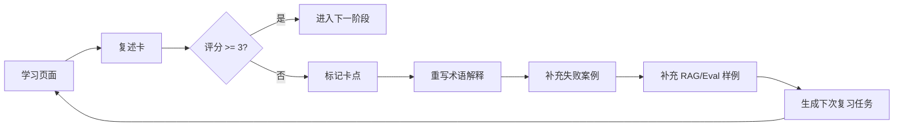

# 中文优先双语与持续学习迭代规范

状态：Open Design 语言与学习闭环规范  
目标：让前端真正帮助中文学习者理解 Agent + RAG，而不是做一个英文工具壳

## 1. 语言决策

默认采用：

```text
中文优先双语
```

含义：

- 中文负责学习理解。
- 英文负责连接工程术语、官方资料、GitHub 项目和后续代码。
- 用户不需要用英文回答复述题。
- 系统不把英文术语硬翻译到失真。

## 2. UI 文案规则

| 区域 | 规则 | 示例 |
|---|---|---|
| 顶部状态 | 中文主标签 + 英文辅助 | 学习模式 Learning mode |
| 导航 | 中文为主 | 全链路、失败推演、评测门禁 |
| 架构节点 | 中文 + 英文术语 | 运行时 Runtime、策略 Policy |
| 按钮 | 中文动作 + 对象 | 查看受控链路、记录复述评分 |
| 复述题 | 中文 | 为什么 RAG 检索结果不能直接可信？ |
| 工程字段 | 英文 | trace_id、policy_decision、eval_case_id |
| 来源文件 | 保持路径原文 | 07-RAG问题诊断与优化/... |

## 3. 固定中英术语表

完整术语来源以 [术语表](../00-课程总览/术语表.md) 为准。本节只列前端最常出现的 UI 显示名，并使用同一套列名，避免后续维护分叉。

| UI 显示名 | English canonical term | 首次出现解释 |
|---|---|---|
| 智能体 | Agent | 不是聊天框，而是能按规则执行长线任务的系统 |
| 运行时 | Runtime | 管理 Run、Step、状态、恢复和错误 |
| 网关 | Gateway | 统称：请求、模型、工具进出的治理入口；界面必须说明是哪一种具体网关 |
| 请求网关 | Request Gateway | 请求进入系统时做身份、租户、限流和路由 |
| 模型网关 | Model Gateway | 控制模型调用、fallback、预算和成本 |
| 工具网关 | Tool Gateway | 工具真正执行前做 schema、权限、凭据和审计检查 |
| 编排器 | Orchestrator | 决定单智能体、多智能体、人工审批和恢复流程 |
| 断点快照 | Checkpoint | 长线任务中断后可恢复的结构化快照 |
| 状态 | State | 当前任务的结构化进度、审批、工具结果和错误 |
| 策略 | Policy | 判断 allow、deny、approval 的规则层 |
| 检索增强 | RAG | 从受控知识源取证据，不等于真理 |
| 记忆 | Memory | 可写入、可撤销、可过期的长期信息 |
| 工具申请 | ToolCall | 模型提出的工具调用申请，不是执行 |
| MCP | Model Context Protocol | 工具、资源、提示词接入协议，不等于企业可信工具治理 |
| 工具注册表 | Tool Registry | 记录工具名称、版本、schema、owner、权限和风险等级 |
| 凭据代理 | Credential Broker | 由平台代管密钥，Agent 不直接接触真实凭据 |
| 轨迹 | Trace | 用于定位问题的运行链路 |
| 追踪步骤 | Span | Trace 中的一次模型、工具、策略或 RAG 步骤 |
| 审计 | Audit | 用于证明谁在何时为何做了什么 |
| 审计事件 | Audit Event | 安全、合规和事故复盘需要保留的关键事实 |
| 评测 | Eval | 判断质量、安全和回归是否过门禁 |
| 评估门禁 | Eval Gate | 评测结果是否允许进入下一阶段的阻塞判断 |
| 发布门禁 | Release Gate | 决定版本是否允许进入下一阶段 |
| 沙箱 | Sandbox | 限制文件、网络、进程、环境变量和工具副作用 |
| 人工介入 | Human-in-the-loop | 高风险动作暂停，等待人审批、修改或拒绝 |
| 治理 | Governance | 版本、权限、评估、审计、发布和回滚的管理闭环 |
| 复述 | Restatement | 用户用自己的话证明真的理解 |

## 4. 页面固定文案

顶部状态条：

```text
学习模式 Learning mode
模拟数据 Mock data
不执行真实操作 No real execution
来源文件 Source files
```

底部学习动作：

```text
查看受控链路
比较坏设计路径
记录复述评分
判断是否阻塞
加入下次复习
```

禁止按钮：

```text
发布
执行退款
连接生产系统
导入真实凭据
审批通过
```

替代按钮：

```text
模拟发布判断
查看 ToolCall 申请
查看 mock 集成边界
查看审批条件
查看 rollback 学习样例
```

## 5. 可持续学习对象

每次学习产生一个学习记录：

```json
{
  "learning_session_id": "mock_session_001",
  "phase": "phase-05",
  "topic": "RAG boundary",
  "question": "为什么 RAG 检索结果不能直接可信？",
  "answer": "用户自己的中文复述",
  "score": 2,
  "missing_parts": ["事故", "负责层", "验收证据"],
  "misconception_tags": ["rag_is_truth"],
  "next_action": "重讲 RAG 证据边界",
  "feedback_targets": ["Concept", "FailureCase", "EvalCase", "RestatementCard"]
}
```

## 6. 学习闭环



## 7. 前端需要支持的持续迭代视图

### 7.1 我的卡点

显示所有低于 3 分的概念：

- 阶段。
- 问题。
- 最近答案。
- 缺失部分。
- 下次复习时间。

### 7.2 误解标签

常见标签：

- `rag_is_truth`：把 RAG 检索结果当真理。
- `toolcall_is_execution`：把工具申请当执行。
- `prompt_controls_permission`：以为 prompt 能管权限。
- `trace_equals_audit`：混淆 trace 和 audit。
- `eval_is_score_only`：把评测当分数装饰。
- `release_is_code_only`：以为发布只发代码。

### 7.3 内容回流

每个卡点必须回流到至少一个对象：

| 卡点类型 | 回流对象 |
|---|---|
| 术语不懂 | Concept |
| 不会判断事故 | FailureCase |
| 不会说负责层 | LayerCard |
| 不会证明通过 | EvidenceCard |
| RAG 理解错误 | RAGEvalCase |
| 复述表达差 | RestatementCard |

## 8. 验收标准

中文化验收：

- 主要导航、按钮、复述题都是中文。
- 核心术语有中英对照。
- 英文不抢主视觉。
- 移动端中英标签不溢出。

持续学习验收：

- 每次复述都有评分。
- 低分能生成卡点标签。
- 卡点能回流到课程内容或评测样例。
- 下次学习能优先看到未掌握内容。
- 用户能看到自己从不会到会的记录。
