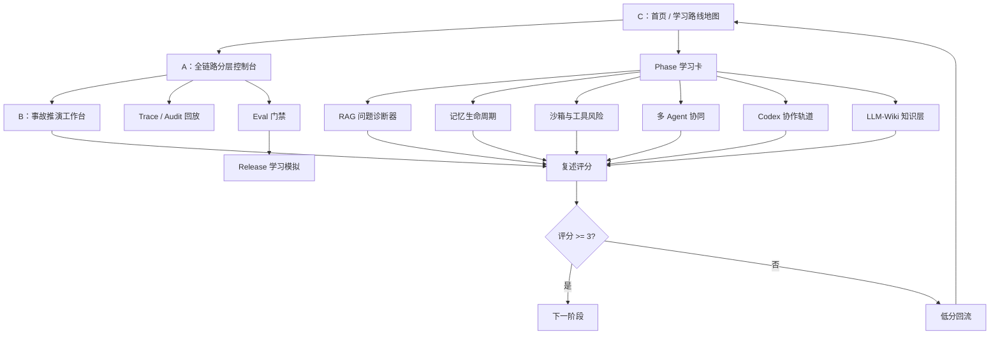

# v0.3 低保真交互与页面流

日期：2026-07-02  
状态：Product Design 原型前置低保真说明  
适用范围：学习可视化前端 v0.3  
源码状态：未创建前端工程  
核心原则：先把教学交互设计清楚，再进入 Product Design 低保真可点击原型；代码实现属于 Implementation-later。

## 1. 本阶段目标

v0.3 不是写代码，也不是做生产控制台。

本阶段要把 v0.2 PRD 转成 Product Design 可执行的低保真页面流：

```text
C 学习路线地图首页
-> A 分层控制台全链路页
-> B 事故推演工作台
-> 专项模块：RAG / 记忆 / 沙箱 / 多 Agent / Codex 协作
-> 知识层：LLM-Wiki / 来源审核 / 知识卡版本
-> 复述评分
-> 低分回流
```

通过 v0.3 后，用户应该能不用代码就说清：

- 我现在学到哪个 Phase。
- 这一页防什么事故。
- 哪一层负责拦截、记录、恢复或评测。
- 我该怎样复述才算真的懂。
- 如果低分，内容如何回流。
- 这次该如何增强提示词、是否调用 subagent、让 subagent 返回什么证据。
- 外部资料、GitHub 项目和课程知识如何进入审核队列，而不是直接变成“正确答案”。

## 2. 全局 App Shell

所有页面共享同一套结构，避免每个模块变成不同风格的页面。

```text
┌────────────────────────────────────────────────────────────────────┐
│ 顶部状态条：学习模式 / 模拟数据 / 不执行真实操作 / 来源文件          │
├──────────────┬──────────────────────────────────────┬─────────────┤
│ Phase 轨道    │ 主视觉工作区                           │ 证据面板     │
│              │                                      │             │
│ 当前阶段      │ 路线图 / 链路图 / 事故链 / 诊断器       │ 事故         │
│ 卡点标记      │                                      │ 负责层       │
│ 下次复习      │                                      │ 验收证据     │
│              │                                      │ source_files │
├──────────────┴──────────────────────────────────────┴─────────────┤
│ 底部复述与回流条：复述评分 / 卡点标签 / 推荐 subagent / 下次动作     │
└────────────────────────────────────────────────────────────────────┘
```

固定边界文案：

```text
学习模式 Learning mode
模拟数据 Mock data
不执行真实操作 No real execution
来源文件 Source files
```

全局禁止：

- 真实发布。
- 真实审批。
- 真实退款。
- 真实凭据。
- 连接生产系统。
- 营销 hero。
- 装饰性卡片墙。
- 只有指标没有教学任务的泛 dashboard。

## 3. 页面流总览



## 4. C 首页：学习路线地图

### 4.1 用途

让半懂学习者知道：

- 我在哪个 Phase。
- 今天只学什么。
- 当前卡点是什么。
- 下一步该点哪里。

### 4.2 默认状态

```text
当前 Phase：Phase 0.1 半懂起步
当前任务：理解“建议不等于执行许可”
主行动：查看受控链路
次行动：查看事故样例 / 查看复述卡
右侧证据：今天不做真实系统、不写代码、不接生产
底部：当前复述评分、卡点标签、下次复习
```

### 4.3 点击路径

| 点击 | 跳转或展开 | 学习目的 |
|---|---|---|
| 当前 Phase 卡 | 打开 Phase 学习卡 | 看目标、事故、产物、过关条件 |
| 查看受控链路 | 进入 A 分层控制台 | 建立系统边界 |
| 查看事故样例 | 进入 B 事故推演 | 从坏设计理解为什么要治理 |
| 我的卡点 | 打开 LearningBacklogBoard | 看低分概念和重讲任务 |
| 推荐 subagent | 打开 Codex 协作轨道 | 学会如何让 Codex 先增强提示词 |
| 知识层状态 | 打开 LLM-Wiki 知识层 | 看资料如何经来源审核、版本记录和低分回流 |

### 4.4 低分状态

当上一轮复述低于 3：

```text
首页不展示“继续下一阶段”为主按钮。
主按钮改为：回看卡点。
右侧显示：缺失事故 / 缺失负责层 / 缺失证据。
底部显示：重讲任务、下次复习、回流对象。
```

### 4.5 高级感要求

- 首页不是课程目录，必须有当前任务和下一步。
- Phase 卡不铺满一屏，默认只展开当前 Phase。
- 卡点和进度要克制显示，不能做游戏化排行榜。

## 5. A 全链路分层控制台

### 5.1 用途

让用户看懂工业级 Agent 不是聊天窗口，而是受控长线任务系统。

### 5.2 主链路

```text
用户请求 User Request
-> 请求网关 Request Gateway
-> 运行时 Runtime
-> 模型网关 Model Gateway
-> 工具网关 Tool Gateway
-> 策略 Policy
-> RAG / Memory / Tools
-> 轨迹 Trace / 审计 Audit
-> 评估门禁 Eval Gate / 发布门禁 Release Gate
```

### 5.3 节点点击后必须显示

```text
白话解释
工单故事映射
少了会出什么事故
负责层
验收证据
source_files
复述题
推荐 subagent
```

### 5.4 状态

| 状态 | 展示 |
|---|---|
| 默认 | 正常受控链路，当前 Phase 对应节点高亮 |
| 坏设计 | 红色路径显示绕过 Tool Gateway / Policy / Audit |
| 阻塞 | Eval Gate 或 Policy 显示 blocked，右侧解释阻塞原因 |
| 低分 | 只保留当前节点和事故解释，减少额外信息 |

### 5.5 高级感要求

- 中心链路必须是主视觉，不被右侧说明抢走。
- 正常路径、失败路径、证据流要用线型和标签区分。
- 不做真实运行按钮，只允许“查看 ToolCall 申请”“模拟判断是否阻塞”。

## 6. B 事故推演工作台

### 6.1 用途

让用户从事故倒推负责层、拦截点、证据和评测门禁。

### 6.2 默认事故

第一版默认聚焦：

```text
重复退款
```

其他事故只做紧凑入口：

- 越权工具。
- 记忆污染。
- 跨租户检索。
- 缺失 trace。
- eval 降级。

### 6.3 交互

| 点击 | 显示 |
|---|---|
| 事故 chip | 切换事故链路 |
| 应拦截层 | 高亮 A 链路里的对应节点 |
| 阻塞判断 | 显示为什么 pass / review / blocked |
| 复述卡 | 进入评分 |
| 低分回流 | 展示 Concept / FailureCase / EvalCase / RestatementCard |

### 6.4 低分状态

低分时页面不继续扩展新事故，而是：

```text
缩小事故范围
显示错误理解
给出白话重讲
要求重新复述
记录卡点标签
```

## 7. RAG 问题诊断器

### 7.1 用途

教用户面对 RAG 问题时知道怎么诊断和优化，而不是只知道“加向量库”。

### 7.2 结构

```text
问题标签
-> 症状
-> 可能原因
-> 诊断指标
-> 优化策略
-> EvalCase
-> 是否阻塞
```

### 7.3 MVP 问题

| 问题 | 默认诊断指标 | 阻塞判断 |
|---|---|---|
| 找不到 | hard retrieval recall | 视业务关键性判断 |
| 找错租户 | tenant_acl_violation_rate | 必须阻塞 |
| 引用不可信 | citation precision | 高风险答案阻塞 |
| 过期知识 | freshness regression | 关键政策阻塞 |
| 答案胡编 | groundedness | 必须阻塞 |
| 记忆污染 | memory boundary eval | 必须阻塞 |

### 7.4 过关复述

```text
这个 RAG 问题是 ________。
我用 ________ 指标诊断。
优化策略是 ________。
对应 eval case 是 ________。
是否阻塞发布：________，因为 ________。
```

## 8. 记忆生命周期

### 8.1 用途

教用户理解长期记忆不是“越多越好”，而是有写入、召回、撤销、过期和审计。

### 8.2 视觉结构

```text
候选记忆
-> 写入门禁
-> 权限与来源
-> TTL / 过期
-> 召回策略
-> 撤销与纠错
-> Audit Event
```

### 8.3 失败状态

```text
错误事实被写入长期记忆
-> 后续任务错误召回
-> 触发记忆污染 eval
-> 阻塞进入下一阶段
```

## 9. 沙箱与工具风险

### 9.1 用途

教用户按工具风险选择隔离、审批和审计，而不是把 Docker 当成万能安全边界。

### 9.2 风险矩阵

| 工具类型 | 风险 | 默认处理 |
|---|---|---|
| 只读检索 | 低到中 | Tool Gateway + 权限过滤 |
| 写数据库 | 高 | Policy + approval + operation_id |
| 文件系统 | 高 | restricted sandbox |
| 网络外发 | 高 | allowlist + audit |
| 凭据相关 | 极高 | Credential Broker，Agent 不直接接触 |

## 10. 多 Agent 协同

### 10.1 用途

教用户理解 planner、executor、reviewer、verifier 的边界，学会按证据合并，而不是按投票合并。

### 10.2 handoff 图

```text
planner
-> executor
-> reviewer
-> verifier
-> main thread arbiter
```

每个角色卡必须展示：

- 输入。
- 输出。
- 权限边界。
- 停止条件。
- 期望证据。

### 10.3 失败状态

```text
两个 agent 同时改同一文件
-> resource lock 缺失
-> trace 显示冲突
-> main thread 停止并重新分配边界
```

## 11. Codex 协作与提示词增强轨道

### 11.1 用途

这是用户最需要学的“如何指挥 Codex”的能力。

### 11.2 结构

```text
原始问题
-> 增强提示词
-> 推荐 subagent
-> 权限边界
-> 期望证据
-> 主线程整合
-> 复述卡
```

### 11.3 示例

| 原始问题 | 增强后的任务 | 推荐 subagent |
|---|---|---|
| 继续讲 RAG | 按问题诊断 RAG，必须包含指标、eval case、阻塞条件和低分复述 | researcher / reviewer |
| 继续完善 PRD | 审查 PRD 与教学目标是否一致，列 P0/P1/P2 缺口 | reviewer |
| 做前端原型 | 先确认 Product Design brief，再基于 C/A/B 组合路线做低保真原型 | planner / reviewer |

## 12. 复述评分与低分回流

### 12.1 评分底线

3 分必须同时包含：

```text
事故
负责层
最小验收证据
```

### 12.2 低分回流

```text
低分复述
-> 卡点标签
-> 重讲任务
-> Concept 改写
-> FailureCase 补充
-> RAG / EvalCase 补充
-> RestatementCard 重写
-> 下次复习
```

## 13. LLM-Wiki 知识层

### 13.1 用途

教用户理解外部资料、GitHub 项目、RAG 技术文章和课程卡片不能直接变成权威知识。

知识层要回答：

- 这条知识来自哪里。
- license 是否允许采用。
- 是否过期。
- 是否经过审核。
- 它服务哪个 Phase、哪个 RAG 诊断问题、哪个 eval case。
- 学习者低分后，它如何回流修订。

### 13.2 视觉结构

```text
来源队列 ImportQueue
-> 来源审核 SourceReview
-> 主题树 KnowledgeTopic
-> 知识卡 KnowledgeCard
-> 版本记录 KnowledgeVersion
-> 课程页 / RAG 诊断 / EvalCase
```

### 13.3 默认状态

```text
当前来源：karpathy/LLM Wiki gist
采用方式：pattern_only
审核状态：needs_review
风险：license unknown / copyright caution / translation drift
课程映射：Phase 5, Phase 7, Phase 8
前端提示：只学习治理模式，不复制外部正文
```

### 13.4 点击路径

| 点击 | 显示 | 学习目的 |
|---|---|---|
| ImportQueue 项 | 新资料为何进入队列 | 明白资料不能直接进课程 |
| SourceReview | license、freshness、quality、copyright | 明白来源审核 |
| KnowledgeCard | 中文学习卡和 source_files | 明白知识卡不是事实本身 |
| KnowledgeVersion | 版本差异和变更原因 | 明白知识会过期 |
| 低分回流 | 复述低分如何生成修订任务 | 明白学习反馈如何维护课程 |

### 13.5 过关复述

```text
这条知识来自 ________。
当前 review_status 是 ________。
它采用方式是 ________，不能直接复制，因为 ________。
它服务的 Phase / RAG 问题 / EvalCase 是 ________。
如果我复述低分，它会回流到 ________。
```

## 14. v0.3 验收清单

进入 Product Design 低保真可点击原型前，必须全部满足：

- [ ] C 首页能显示当前 Phase、当前任务、卡点、下一步。
- [ ] A 链路页能显示正常路径、失败路径、证据流和阻塞点。
- [ ] B 事故页默认只聚焦一个事故，能倒推负责层和证据。
- [ ] RAG 诊断器能按问题、指标、策略、eval case、阻塞判断展示。
- [ ] 记忆生命周期能显示写入门禁、TTL、撤销、过期和审计。
- [ ] 沙箱模块能显示工具风险、sandbox profile 和审批条件。
- [ ] 多 Agent 模块能显示角色输入、输出、停止条件和证据合并。
- [ ] Codex 协作轨道能显示增强提示词、推荐 subagent、期望证据和主线程整合。
- [ ] LLM-Wiki 知识层能显示 ImportQueue、SourceReview、KnowledgeTopic、KnowledgeCard、KnowledgeVersion、source_files、review_status、freshness 和 license。
- [ ] 每页都有学习模式 Learning mode / 模拟数据 Mock data / 不执行真实操作 No real execution / 来源文件 Source files。
- [ ] 每页都有复述题。
- [ ] 低分能产生回流对象和下次复习。
- [ ] 页面不出现真实生产操作入口。

## 15. 下一步

v0.3 通过并完成 v0.4-pre 冻结包后，再进入 Product Design 低保真可点击原型。  
进入实现前，仍然必须重新确认：

- brief 是否仍然匹配本文件。
- 视觉目标是否选用 C/A/B 组合路线。
- 是否只接 mock 数据。
- 是否保留中文优先双语。
- 是否没有真实凭据和真实生产写操作。

在进入 Product Design 可点击原型前，必须先完成 v0.4-pre 冻结包：

1. [v0.4-pre 原型前冻结包](10-v0.4-pre原型前冻结包.md)
2. [页面状态矩阵与逐页验收脚本](11-页面状态矩阵与逐页验收脚本.md)
3. [Mock 数据字典与样例包](12-Mock数据字典与样例包.md)
4. [学习验证脚本与 Go-No-Go](13-学习验证脚本与Go-No-Go.md)

如果这些冻结资产没有证明每页都有 Phase、事故、负责层、source_files、复述题和低分回流，不能进入原型。
