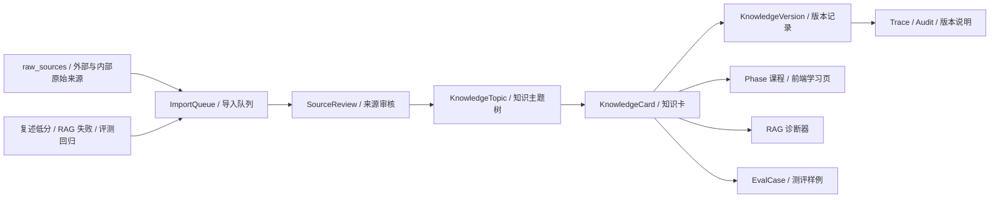

# LLM-Wiki 知识层与可维护扩展方案

日期：2026-07-02  
状态：v0.3 前端与课程知识层扩展方案  
目标：让学习项目长期可维护，而不是变成一次性文档集合

## 1. 为什么要加入 LLM-Wiki 知识层

当前项目已经有 PRD、阶段手册、RAG、测评、安全、多 Agent、前端设计文档。继续扩展时，如果没有知识治理层，会出现三个问题：

1. 资料来源越来越多，但不知道哪些能信。
2. GitHub 项目更新很快，课程内容容易过期。
3. 学习者低分、RAG 失败、评测回归无法稳定回流。

因此本项目引入 `LLM-Wiki` 思想，但只吸收治理模式：

```text
原始来源不可改
LLM 只生成可审核中间知识页
课程只引用已审核知识卡
每次低分和评测失败都能回流
```

这不是新增一个复杂产品，而是让课程具备可持续维护能力。

## 2. 项目内知识层架构



### 2.1 关键原则

- `raw_sources` 保存来源事实，不在课程里直接搬运。
- `ImportQueue` 收集新资料、低分反馈和 RAG 失败样例。
- `SourceReview` 判断 license、质量、更新时间、版权、翻译风险。
- `KnowledgeCard` 是学习者真正看到的知识单元。
- `KnowledgeVersion` 记录知识为什么变化。
- 前端只展示 mock 数据和教学状态，不抓取真实外部仓库。

## 3. 和 RAG 的关系

`LLM-Wiki` 不是替代 RAG，而是给 RAG 前面加一层可治理知识。

| 层 | 作用 | 失败风险 | 教学表达 |
|---|---|---|---|
| raw_sources | 保存原始材料 | 来源不明、license 不清 | 来源队列 |
| wiki / KnowledgeCard | 把材料整理成可学习知识 | LLM 总结幻觉、过期 | 知识卡状态 |
| RAG | 按问题召回相关知识 | 找不到、找错、引用不可信 | RAG 诊断器 |
| Eval | 判断回答是否可靠 | 平均分掩盖高风险失败 | Eval 门禁 |
| Low-score loop | 学不会就回流 | 分数只记录不修复 | 回流队列 |

前端必须让用户理解：

```text
RAG 不是“搜到就可信”。
知识卡也不是“生成就可信”。
只有来源、审核、版本、评测都能追溯，才是可维护知识。
```

## 4. 前端新增模块

### 4.1 模块名称

```text
知识层 / LLM-Wiki
```

### 4.2 入口

- C 首页：显示“知识层健康状态”。
- A 全链路页：在 RAG / Memory / Eval 附近显示知识来源流。
- RAG 诊断器：点击“过期知识 / 引用不可信”时打开知识卡证据。
- 复述低分：低分后生成 `ImportQueue` 回流项。
- Release 学习模拟：显示知识版本是否通过 freshness gate。

### 4.3 页面结构

```text
左侧：知识主题树 KnowledgeTopic
中间：知识卡 KnowledgeCard
右侧：来源审核 SourceReview + 版本记录 KnowledgeVersion
底部：导入队列 ImportQueue + 低分回流
```

### 4.4 必须状态

| 状态 | 显示方式 | 学习含义 |
|---|---|---|
| draft | 草稿标签 + 低置信提示 | LLM 生成内容不能直接进入课程 |
| needs_review | 待审核标签 + 来源风险 | 需要检查 license、freshness、质量 |
| approved | 已审核标签 + source_files | 可以进入课程页 |
| deprecated | 已废弃标签 + 替代版本 | 知识会过期 |
| blocked_by_license | 阻塞标签 + 风险说明 | license 不清不能搬运 |

## 5. 数据对象

### 5.1 KnowledgeSource

```json
{
  "source_id": "source_karpathy_llm_wiki_gist_20260702",
  "title": "LLM Wiki Pattern",
  "url": "https://gist.github.com/karpathy/442a6bf555914893e9891c11519de94f",
  "source_type": "gist",
  "license_spdx": "unknown",
  "license_status": "needs_review",
  "fetched_at": "2026-07-02",
  "source_hash": "mock_hash",
  "language": "en",
  "risk_level": "medium",
  "adoption_mode": "pattern_only"
}
```

### 5.2 KnowledgeTopic

```json
{
  "topic_id": "topic_llm_wiki_knowledge_governance",
  "parent_topic_id": null,
  "canonical_name_en": "Knowledge Governance",
  "display_name_zh": "知识治理",
  "phase": "phase-07",
  "layer": "Governance",
  "tags": ["LLM-Wiki", "RAG", "Eval", "SourceReview"],
  "prerequisites": ["source_files", "RAG diagnostic"],
  "difficulty": "intermediate",
  "owner_doc_path": "08-学习可视化前端设计/09-LLM-Wiki知识层与可维护扩展方案.md"
}
```

### 5.3 KnowledgeCard

```json
{
  "card_id": "card_knowledge_card_is_not_truth_001",
  "topic_id": "topic_llm_wiki_knowledge_governance",
  "title_zh": "知识卡不是事实本身",
  "summary_zh": "知识卡是经过来源审核和版本管理的学习解释，不等于原始事实，也不能绕过 RAG/Eval。",
  "canonical_terms": ["KnowledgeCard", "SourceReview", "KnowledgeVersion"],
  "source_ids": ["source_karpathy_llm_wiki_gist_20260702"],
  "source_files": ["10-GitHub项目调研/LLM-Wiki知识层调研-2026-07-02.md"],
  "confidence_score": 0.84,
  "quality_score": 4,
  "review_status": "needs_review",
  "used_in_lessons": ["phase-05", "phase-07", "phase-08"],
  "rag_failure_modes": ["untrusted_citation", "stale_knowledge"],
  "front_end_panel": "LLMWikiKnowledgeLayer"
}
```

### 5.4 KnowledgeVersion

```json
{
  "version_id": "kv_card_knowledge_card_is_not_truth_001_001",
  "card_id": "card_knowledge_card_is_not_truth_001",
  "semver": "0.1.0",
  "content_hash": "mock_content_hash",
  "source_hashes": ["mock_source_hash"],
  "change_reason": "initial_knowledge_layer_design",
  "changed_by": "course",
  "created_at": "2026-07-02",
  "valid_from": "2026-07-02",
  "valid_to": null,
  "supersedes_version_id": null
}
```

### 5.5 SourceReview

```json
{
  "review_id": "sr_karpathy_llm_wiki_gist_20260702",
  "source_id": "source_karpathy_llm_wiki_gist_20260702",
  "reviewer": "researcher_subagent",
  "license_result": "unknown_do_not_copy",
  "quality_result": "high_pattern_value",
  "freshness_result": "manual_review_required",
  "hallucination_risk": "medium",
  "copyright_risk": "medium",
  "translation_risk": "medium",
  "decision": "pattern_only",
  "notes": "Use the governance idea. Do not quote or copy long text.",
  "reviewed_at": "2026-07-02"
}
```

### 5.6 ImportQueue

```json
{
  "queue_id": "iq_low_score_rag_freshness_001",
  "source_id": "source_rag_reference_20260702",
  "requested_by": "learning_feedback",
  "reason": "用户复述时把 RAG 搜到的内容当作事实",
  "target_topic_id": "topic_rag_freshness",
  "target_doc_path": "07-RAG问题诊断与优化/00-RAG索引.md",
  "priority": "high",
  "status": "needs_source_review",
  "dedupe_key": "rag_found_not_truth",
  "blocked_reason": null,
  "created_at": "2026-07-02",
  "processed_at": null,
  "trigger_type": "restatement_low_score",
  "eval_case_id": "eval_untrusted_citation",
  "rag_query_id": "mock_query_001",
  "learner_feedback_id": "mock_feedback_001",
  "score_before": 2,
  "score_after": null,
  "repair_action": "rewrite_concept_and_add_eval_case"
}
```

## 6. 可维护目录建议

当前不直接创建大量空目录。进入 Implementation-later 后，可以按下面结构扩展：

```text
12-知识层与LLM-Wiki
  00-知识层索引.md
  来源登记-KnowledgeSource.md
  主题树-KnowledgeTopic.md
  知识卡-KnowledgeCard.md
  来源审核-SourceReview.md
  导入队列-ImportQueue.md
  版本记录-KnowledgeVersion.md
```

现在先把权威规则放在本文件和调研文档中，避免目录膨胀。

## 7. 课程维护循环

每次课程迭代按这个循环：

```text
学习者提问 / 复述低分 / RAG 失败
-> 生成 ImportQueue
-> researcher subagent 搜集或核验资料
-> reviewer subagent 审核是否能进入课程
-> 更新 KnowledgeCard
-> 关联 EvalCase / RestatementCard
-> 前端显示版本变化和低分回流
```

每次引入外部资料前的增强提示词：

```text
请作为 researcher subagent，只读调研指定主题。
必须返回来源链接、stars/更新时间/license 快照、可采用方式、不能采用的原因、对课程 Phase 的映射、剩余未知项。
不要复制外部内容，不要编辑文件。
```

主线程整合时的判断：

```text
这个资料是否解决具体学习卡点？
是否能映射到 Phase、事故、负责层和验收证据？
license 是否允许进入课程正文？
是否需要只保留为证据库链接？
是否会引入过期或错误理解？
```

## 8. Product Design 表达要求

知识层前端必须保持高级感和教学性：

- 不做“资料瀑布流”。
- 不做“GitHub star 排行榜”。
- 不把知识卡做成装饰卡片墙。
- 主题树、来源审核、版本差异、低分回流必须可扫描。
- 状态不能只靠颜色表达，必须有文字和图标。
- 每个知识卡都要显示 `source_files`、`review_status`、`freshness`、`license`。
- 每次点击只展开一个焦点：来源、知识卡、版本 diff 或回流任务。

页面过关复述：

```text
这条知识来自 ________。
当前状态是 ________。
它能进入课程 / 不能进入课程，因为 ________。
如果学习者低分，它会回流到 ________。
对应的 RAG / Eval 风险是 ________。
```

## 9. 停止条件

出现以下情况，停止扩展知识层：

- 外部资料没有 license 或来源却进入课程正文。
- LLM 生成卡片没有审核状态。
- 知识层让用户误以为资料越多越好。
- 前端变成资料搜索站，而不是 Agent/RAG 教学控制台。
- 低分反馈只记录分数，没有进入 `ImportQueue`。
- RAG 诊断不能追溯到 `KnowledgeCard` 和 `EvalCase`。

## 10. 最真实判断

建议加入 `LLM-Wiki` 知识层。

但要严格限定为：

```text
知识治理层
不是资料搬运层
不是自动生成课程正文
不是新的复杂产品范围
```

它对本项目最有用的地方，是让你未来不用靠“记住很多项目和资料”来学习，而是学会设计一套可审查、可更新、可回流的知识系统。

这和工业级 Agent 的核心一致：

```text
模型输出不能直接可信。
工具调用不能直接执行。
外部知识也不能直接进入课程。
一切都要有来源、门禁、版本、评测和回流。
```

