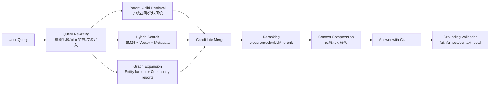
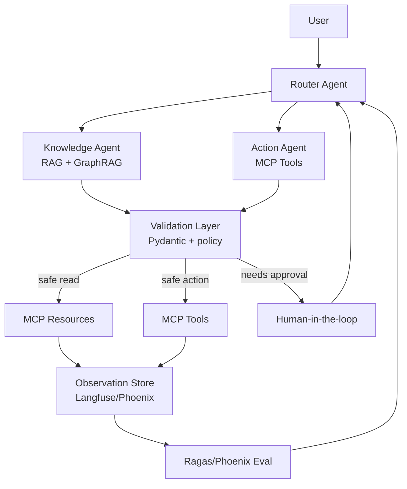

# 2026 工业级 Agent 架构师路线图与项目方案

生成日期：2026-06-17  
输入文件：`C:/Users/五两轻/Desktop/新建 文本文档.txt`

## 先校准事实

原文档是一份强约束提示词，核心需求是：给一名计算机大三学生一条能对齐 2026 Agent 工程岗位的硬核技术路线，包含工具链、架构、代码骨架、项目方案、简历话术和 24 周训练计划。

有两点必须先拆出来：

1. 文档要求输出 `<thought_process>` 三轮推理。这里不输出私有推理链。下面给的是可审计的工程结论、设计依据和执行步骤。
2. 文档提到 “MCP v2”“gVisor v2”“LangGraph Enterprise”等说法。按公开官方资料核对：MCP 官方规格主要采用日期版本，例如 `2025-06-18`，并在 2026-05-21 发布了 `2026-07-28` 规格候选版本说明，不能简单写成 “v2”。gVisor 官方公开文档仍围绕 `runsc` OCI runtime、Docker、Kubernetes 集成展开。技术路线应该对齐官方概念，不要背市场黑话。

可作为当前路线底座的官方资料包括：MCP [Tools](https://modelcontextprotocol.io/specification/2025-06-18/server/tools)、[Resources](https://modelcontextprotocol.io/specification/2025-06-18/server/resources)、[Prompts](https://modelcontextprotocol.io/specification/2025-06-18/server/prompts) 与 [2026-07-28 RC 博文](https://blog.modelcontextprotocol.io/posts/2026-07-28-release-candidate/)，LangGraph [overview](https://docs.langchain.com/oss/python/langgraph/overview)、[persistence](https://docs.langchain.com/oss/python/langgraph/persistence)、[time-travel](https://docs.langchain.com/oss/python/langgraph/use-time-travel)、[fault tolerance](https://docs.langchain.com/oss/python/langgraph/fault-tolerance)，RedisVL [HybridQuery](https://docs.redisvl.com/en/latest/concepts/queries.html)，gVisor [runsc/Docker](https://gvisor.dev/docs/user_guide/quick_start/docker/)，Microsoft GraphRAG [docs](https://microsoft.github.io/graphrag/)，Langfuse [tracing](https://langfuse.com/docs/observability/overview)，Ragas [metrics](https://docs.ragas.io/en/stable/concepts/metrics/available_metrics/) 与 [evaluate](https://docs.ragas.io/en/stable/references/evaluate/)，Phoenix [tracing/evals](https://arize.com/docs/phoenix)，Pydantic v2 [validators](https://pydantic.dev/docs/validation/latest/concepts/validators/) 与 [JSON Schema](https://pydantic.dev/docs/validation/latest/concepts/json_schema/)。

---

## 〇、2026 工业级 Agent 市场情报与技术底座速览

### 5 个高薪技能锚点

| 技能锚点 | 生产痛点 | 必须交付的工程能力 | A/B Contrast | Underlying Logic | Anti-Pattern |
|---|---|---|---|---|---|
| 状态机编排 | Agent 跑 2 天后断电、超时、人工插队，流程状态丢失 | 用 LangGraph/自研 DAG 保存每步 state、next node、checkpoint id | A: 线性 Chain；B: 可恢复 StateGraph | 长任务不是聊天，是分布式工作流 | 只存 chat history，不存节点输出和待执行边 |
| MCP 工具网关 | 每个模型接每个业务系统都写胶水代码 | 实现标准 Tools/Resources/Prompts，做权限、审计、schema、幂等 | A: 函数直连 DB；B: MCP Server + Gateway | Tool calling 的本质是受控 RPC | 让模型直接拼 SQL 或 Bash |
| Memory/RAG/GraphRAG | 长上下文爆栈、向量召回漏掉跨文档关系 | Redis session cache + hybrid search + rerank + GraphRAG | A: 纯向量 top-k；B: 关键词、向量、图结构合流 | 商用知识库同时需要精确词、语义和关系跳转 | 把所有历史塞进 prompt |
| 防腐层与沙箱 | LLM 输出脏 JSON、Prompt 注入、生成代码逃逸 | Pydantic v2 校验、重试修复、Docker+gVisor/Wasm 隔离 | A: 信任模型输出；B: 所有 I/O 过 schema 和 policy | 模型负责候选，代码负责边界 | `eval()`、裸 `subprocess`、明文密钥进 prompt |
| 可观测与评估 | 改一次 prompt 线上质量崩，无法复盘 | Langfuse/Phoenix trace，Ragas golden dataset，CI 跑分 | A: 肉眼试问；B: 数据集 + 指标 + trace | Agent 质量必须可回放、可比较、可归因 | 只看最终回答，不记录工具链和检索证据 |

### 主流框架生产对比

| 框架 | 强项 | 短板 | 适合做什么 | 不适合做什么 |
|---|---|---|---|---|
| LangGraph | 官方定位是 durable execution、streaming、human-in-the-loop、persistence；checkpointer 支持故障恢复和 time travel | 抽象较底层，需要自己设计 state schema、节点边界、错误策略 | 长周期任务、多 Agent DAG、审批流、状态回滚 | 快速搭一个无状态聊天 demo |
| CrewAI | Flows 推荐承载生产应用的状态和执行顺序，Crew 负责 agent 步骤；上手快，角色拆分直观 | 深度可控性和底层恢复语义不如 LangGraph 直接 | 研究报告、内容生产、业务自动化编排 | 强一致事务、复杂回滚、严格并发控制 |
| AutoGen | AgentChat 提供 agents、teams、selector group chat、swarm 等多 Agent 模式 | 对生产级状态持久、权限、审计仍需外围系统补齐 | 多 Agent 对话研究、协作原型、评审模拟 | 直接承载核心业务写入链路 |
| Dify | 可视化 Workflow、RAG、Agent、模型管理、日志、API 出口齐全 | 平台化抽象多，复杂定制和底层时序控制受限 | 企业内部快速交付 AI 应用、运营可配置工作流 | 展示底层工程深度的校招旗舰项目 |

结论：秋招项目主线选 LangGraph 或自研轻量 DAG，外围接 MCP、RedisVL、GraphRAG、Pydantic、gVisor、Langfuse/Phoenix、Ragas。CrewAI 和 Dify可以作为对比调研，不要把它们当作唯一底座。

---

## 一、用好 AI 篇：Vibe Coding 工业级可控编码艺术

### 1. 技术指令的底层认知

1. Boundary Drift Control  
   把改动边界写成文件、函数、接口、测试名单。执行时只允许修改授权路径。每次生成后跑 `git diff --stat` 和单测，发现越界改动立即回滚本轮补丁。

2. Strong-typed Schema Contract  
   所有模型输出必须落到 `Pydantic BaseModel`、`TypedDict`、OpenAPI schema 或 JSON Schema。模型不能“返回一段大概像 JSON 的文本”，只能返回能被解析和断言的数据。

3. Task Linear Decomposition  
   把任务拆成：读取现状、写失败测试、最小实现、跑测试、补边界测试、生成变更说明。每一步输出可检查文件，不让模型在一个回合里同时改架构、样式、测试和文档。

### 2. 可直接粘贴的 `.cursorrules`

```text
# Project AI Coding Rules

You are editing a production codebase. Obey these rules strictly.

## Execution Contract
- Read the relevant files before editing.
- State the exact files/functions you will touch before generating patches.
- Do not modify files outside the user-approved scope.
- Do not rename public APIs unless the task explicitly asks for a breaking change.
- Preserve existing style, architecture, dependency choices, and test conventions.

## TDD Contract
- For behavior changes, write or update failing tests first.
- Run the narrowest relevant test command after implementation.
- Add at least one edge-case test for parsing, validation, timeout, retry, or empty input.
- Never mark the task done without reporting the test command and result.

## Type Contract
- Python: use Pydantic v2 or TypedDict/dataclass for structured boundaries.
- TypeScript: use strict types and zod/io-ts style runtime validation for external inputs.
- No `Any` unless a comment explains the external boundary and a validator follows.
- All tool-call outputs must be parsed into typed schemas before downstream use.

## Agent Safety Contract
- Treat LLM output as untrusted input.
- No direct SQL, shell, filesystem, or network action from raw model text.
- All tool invocations require schema validation, authorization check, timeout, retry budget, and audit log.
- Redact secrets before prompts, logs, traces, and test snapshots.

## Diff Hygiene
- Keep patches small.
- Do not perform unrelated refactors.
- Do not reformat entire files unless formatting is the requested task.
- If an existing file contains user changes, preserve them and patch around them.

## Completion Report
Return:
1. Changed files
2. Test command and result
3. Edge case covered
4. Residual risks
```

### 3. 日常对话控制协议

预声明模板：

```text
你将修改 [Target_Module] 中的 [Target_Function]。
只允许触碰这些路径：[Allowed_Files]。
输入契约：[Input_Schema]。
输出契约：[Expected_Schema]。
先阅读相关代码，列出你将修改的函数和测试文件。未确认前不要写补丁。
```

增量防腐模板：

```text
现在只实现 [Step_Name]。
禁止修改 [Frozen_Context]。
必须新增或更新测试：[Test_Name]。
若发现需要额外文件，先说明原因，不要直接修改。
生成补丁后输出 diff 摘要和越界检查结果。
```

自检收尾模板：

```text
请按以下清单自检本轮改动：
1. [Expected_Schema] 是否被运行时校验；
2. [Failure_Case] 是否有测试；
3. 是否有未授权文件变更；
4. 是否记录 timeout/retry/audit；
5. 给出可复制的测试命令。
只输出证据，不输出泛泛解释。
```

---

## 二、架构攻坚篇：Agent 核心基建的工业级落地

### 1. 工业级持久化多级 Memory 架构

目标不是“记住聊天”，而是把信息按生命周期拆开：

| 层级 | 存储 | TTL | 内容 | 查询策略 |
|---|---|---|---|---|
| Working Memory | LangGraph state/checkpoint | 当前 thread | 当前任务状态、节点输出、待执行边 | thread_id + checkpoint_id |
| Session Cache | Redis | 分钟到小时 | 最近交互、工具摘要、短期偏好 | key-value + sorted score |
| Semantic Memory | RedisVL/向量库 | 天到月 | 文档 chunk、经验摘要、用户事实 | hybrid search + rerank |
| Causal Memory | GraphRAG/Neo4j/关系表 | 长期 | 实体、关系、事件、因果链 | entity fan-out + community summary |

Python 骨架：

```python
from __future__ import annotations

import asyncio
import time
from dataclasses import dataclass
from typing import Protocol

from pydantic import BaseModel, Field


class MemoryItem(BaseModel):
    id: str
    text: str
    source: str
    created_at: float
    last_used_at: float
    importance: float = Field(ge=0, le=1)
    token_count: int = Field(ge=1)


class VectorIndex(Protocol):
    async def hybrid_search(self, query: str, k: int) -> list[MemoryItem]: ...
    async def upsert(self, items: list[MemoryItem]) -> None: ...


class GraphIndex(Protocol):
    async def expand_entities(self, query: str, budget_tokens: int) -> list[MemoryItem]: ...


@dataclass
class MemoryPolicy:
    max_context_tokens: int = 16_000
    recent_ratio: float = 0.35
    semantic_ratio: float = 0.45
    graph_ratio: float = 0.20
    decay_half_life_hours: float = 72


class MemoryScheduler:
    def __init__(self, redis_client, vector_index: VectorIndex, graph_index: GraphIndex, policy: MemoryPolicy):
        self.redis = redis_client
        self.vector = vector_index
        self.graph = graph_index
        self.policy = policy

    def decayed_score(self, item: MemoryItem, now: float) -> float:
        hours = max((now - item.last_used_at) / 3600, 0)
        recency = 0.5 ** (hours / self.policy.decay_half_life_hours)
        density = min(1.0, 400 / max(item.token_count, 1))
        return 0.55 * item.importance + 0.30 * recency + 0.15 * density

    def pack_by_budget(self, items: list[MemoryItem], budget: int) -> list[MemoryItem]:
        packed, used = [], 0
        for item in sorted(items, key=lambda x: self.decayed_score(x, time.time()), reverse=True):
            if used + item.token_count > budget:
                continue
            packed.append(item)
            used += item.token_count
        return packed

    async def build_context(self, thread_id: str, query: str) -> list[MemoryItem]:
        recent_budget = int(self.policy.max_context_tokens * self.policy.recent_ratio)
        semantic_budget = int(self.policy.max_context_tokens * self.policy.semantic_ratio)
        graph_budget = int(self.policy.max_context_tokens * self.policy.graph_ratio)

        recent = await self.load_recent_session_items(thread_id)
        semantic = await self.vector.hybrid_search(query=query, k=32)
        graph = await self.graph.expand_entities(query=query, budget_tokens=graph_budget)

        return [
            *self.pack_by_budget(recent, recent_budget),
            *self.pack_by_budget(semantic, semantic_budget),
            *self.pack_by_budget(graph, graph_budget),
        ]

    async def load_recent_session_items(self, thread_id: str) -> list[MemoryItem]:
        raw_items = await self.redis.lrange(f"session:{thread_id}:memory", 0, 100)
        return [MemoryItem.model_validate_json(x) for x in raw_items]

    async def async_summarize_if_needed(self, thread_id: str, summarizer) -> None:
        items = await self.load_recent_session_items(thread_id)
        total_tokens = sum(x.token_count for x in items)
        if total_tokens < self.policy.max_context_tokens * 1.2:
            return
        old_items = sorted(items, key=lambda x: x.created_at)[: max(1, len(items) // 3)]
        summary_text = await summarizer([x.text for x in old_items])
        summary = MemoryItem(
            id=f"summary:{thread_id}:{int(time.time())}",
            text=summary_text,
            source="async_summary",
            created_at=time.time(),
            last_used_at=time.time(),
            importance=0.7,
            token_count=max(1, len(summary_text) // 4),
        )
        await self.vector.upsert([summary])
        await self.redis.lpush(f"session:{thread_id}:memory", summary.model_dump_json())


async def after_each_agent_step(memory: MemoryScheduler, thread_id: str, summarizer) -> None:
    asyncio.create_task(memory.async_summarize_if_needed(thread_id, summarizer))
```

工程要点：

- Redis 保存 session 热数据，不承担长期知识推理。
- RedisVL 的 HybridQuery 把 BM25/全文检索和向量语义检索合并，适合解决“专有名词必须精确命中，同时还要语义扩展”的 RAG 场景。
- GraphRAG 用实体、关系、community summary 处理跨文档、多跳、全局摘要问题。
- Context 裁剪不能只按时间排序，要按重要性、衰减、信息密度、检索相关性混合排序。

### 2. 高级 RAG 生产链路



传统单体向量检索崩溃的原因：

- 查询里有精确词、版本号、错误码时，纯向量会漏召回。
- 文档 chunk 太小会丢上下文，chunk 太大会稀释 embedding。
- 多跳问题需要实体关系，不是 top-k 相似度能解决。
- 初始召回应偏 recall，最终注入 prompt 前再 rerank 和压缩。

生产策略：

- Query Rewriting：把“帮我查这个报错”改写成错误码、模块、版本、环境四组查询。
- Parent-Child：小 chunk 用于 embedding，大 parent 用于回答上下文。
- Hybrid：RedisVL/RRF 合并全文和向量排名。
- Rerank：用 CohereRerank、bge-reranker、LLM judge 或自研 cross-encoder。
- Validation：用 Ragas 的 context precision、context recall、faithfulness、tool call accuracy 指标跑回归。

### 3. 长周期状态机与状态回滚

LangGraph 的关键概念可以落到一张表：

| 概念 | 工程含义 |
|---|---|
| State | 当前图运行的结构化状态，例如 messages、task_plan、tool_results、approval_status |
| Node | 一个可重试、可观测、可超时的执行单元 |
| Edge | 状态转移规则 |
| Checkpoint | 某个 thread 在某一步后的 state 快照 |
| Store | 跨 thread 的长期记忆或应用数据 |
| Time travel | 从旧 checkpoint replay 或 fork，不重跑旧 checkpoint 之前的节点 |

关系型数据库实现思路：

```sql
create table agent_checkpoints (
    thread_id text not null,
    checkpoint_id text not null,
    parent_checkpoint_id text,
    node_name text not null,
    state_json jsonb not null,
    next_nodes jsonb not null,
    writes_json jsonb not null,
    created_at timestamptz not null default now(),
    primary key (thread_id, checkpoint_id)
);

create index idx_agent_checkpoints_thread_time
on agent_checkpoints(thread_id, created_at desc);
```

运行规则：

1. 每个节点执行前读取最新 checkpoint。
2. 节点输出先写入临时 writes。
3. 校验通过后合并 state，落 checkpoint。
4. 外部副作用必须带 idempotency key，例如 `thread_id:checkpoint_id:tool_name`。
5. replay 从某个 checkpoint 的 `next_nodes` 继续跑；fork 复制旧 state，写新 checkpoint 分支。

LangGraph 示例骨架：

```python
from typing_extensions import TypedDict
from langgraph.graph import StateGraph, START, END
from langgraph.checkpoint.memory import InMemorySaver


class AgentState(TypedDict):
    user_query: str
    plan: list[str]
    tool_results: list[dict]
    final_answer: str | None


def plan_node(state: AgentState):
    return {"plan": ["retrieve", "act", "verify"]}


def act_node(state: AgentState):
    return {"tool_results": [{"status": "ok"}]}


def verify_node(state: AgentState):
    return {"final_answer": "verified"}


builder = StateGraph(AgentState)
builder.add_node("plan", plan_node)
builder.add_node("act", act_node)
builder.add_node("verify", verify_node)
builder.add_edge(START, "plan")
builder.add_edge("plan", "act")
builder.add_edge("act", "verify")
builder.add_edge("verify", END)

graph = builder.compile(checkpointer=InMemorySaver())
config = {"configurable": {"thread_id": "ticket-20260617-001"}}
graph.invoke({"user_query": "diagnose incident", "plan": [], "tool_results": [], "final_answer": None}, config)

history = list(graph.get_state_history(config))
before_act = next(s for s in history if s.next == ("act",))
graph.invoke(None, before_act.config)
```

### 4. 工具调用背压流控与重试自愈

背压不是“慢点调用”，而是保护下游系统不被 Agent 的并发和重试打穿。

核心组件：

- `asyncio.Semaphore` 控制并发。
- 每个 tool 配置 timeout、retry budget、rate limit。
- Pydantic 校验参数和结果。
- 外部写操作必须幂等。
- 格式污染时进入 fixing loop，不把脏输出传给下游。

```python
import asyncio
from typing import Any

from pydantic import BaseModel, Field, ValidationError
from tenacity import retry, retry_if_exception_type, stop_after_attempt, wait_exponential_jitter


class ToolArgs(BaseModel):
    ticket_id: str = Field(pattern=r"^[A-Z]+-\d+$")
    action: str = Field(pattern=r"^(read|diagnose|comment)$")
    payload: dict[str, Any] = Field(default_factory=dict)


class ToolResult(BaseModel):
    ok: bool
    data: dict[str, Any] = Field(default_factory=dict)
    error_code: str | None = None


class ToolGateway:
    def __init__(self, max_concurrency: int = 8):
        self.sem = asyncio.Semaphore(max_concurrency)

    async def repair_args(self, raw: str, error: str, llm) -> ToolArgs:
        fixed = await llm.structured_fix(
            schema=ToolArgs.model_json_schema(),
            bad_payload=raw,
            validation_error=error,
        )
        return ToolArgs.model_validate_json(fixed)

    @retry(
        retry=retry_if_exception_type((TimeoutError, ConnectionError)),
        wait=wait_exponential_jitter(initial=0.5, max=8),
        stop=stop_after_attempt(3),
        reraise=True,
    )
    async def call_downstream(self, args: ToolArgs, idempotency_key: str) -> ToolResult:
        async with self.sem:
            async with asyncio.timeout(10):
                raw = await external_api_call(args.model_dump(), idempotency_key=idempotency_key)
                return ToolResult.model_validate(raw)

    async def invoke(self, raw_args: str, thread_id: str, checkpoint_id: str, llm) -> ToolResult:
        try:
            args = ToolArgs.model_validate_json(raw_args)
        except ValidationError as exc:
            args = await self.repair_args(raw_args, str(exc), llm)

        idempotency_key = f"{thread_id}:{checkpoint_id}:{args.ticket_id}:{args.action}"
        try:
            return await self.call_downstream(args, idempotency_key)
        except Exception as exc:
            return ToolResult(ok=False, error_code=type(exc).__name__, data={"message": str(exc)})
```

### 5. 极高危安全隔离沙箱

Agent 生成代码的最低安全线：

1. 模型只能生成候选代码。
2. Gateway 做策略扫描和敏感信息脱敏。
3. Runner 把代码写入临时只读挂载目录。
4. Docker 使用非 root 用户、只读 rootfs、禁网络、限制 CPU/内存/pids。
5. Linux 环境优先用 gVisor `runsc` runtime 增强容器隔离。
6. 高风险插件可以改成 Wasm 执行，禁止任意系统调用。

gVisor 命令骨架：

```bash
sudo runsc install
sudo systemctl restart docker
docker run --runtime=runsc --rm hello-world
```

执行不可信 Python 的容器命令：

```bash
docker run --runtime=runsc --rm \
  --network=none \
  --read-only \
  --user 65532:65532 \
  --cpus=0.5 \
  --memory=256m \
  --pids-limit=64 \
  --cap-drop=ALL \
  -v "$PWD/sandbox/input:/workspace/input:ro" \
  -v "$PWD/sandbox/output:/workspace/output:rw" \
  python:3.12-slim \
  python /workspace/input/main.py
```

Gateway 策略示例：

```yaml
policy:
  deny_patterns:
    - "os.environ"
    - "subprocess"
    - "socket"
    - "requests"
    - "open('/etc/"
    - "rm -rf"
  redact_patterns:
    - name: api_key
      regex: "(?i)(api[_-]?key|secret|token)\\s*=\\s*['\\\"][^'\\\"]+"
      replacement: "\\1=<REDACTED>"
  tool_permissions:
    filesystem:
      read:
        - "/workspace/input"
      write:
        - "/workspace/output"
    network:
      enabled: false
    shell:
      enabled: false
  execution_limits:
    timeout_seconds: 10
    memory_mb: 256
    cpu: 0.5
    max_output_bytes: 200000
```

---

## 三、市场对齐篇：多模型协同、可观测性与自动化评估

### 1. 多模型级联

模型级联的目标不是炫技，是省钱和降低延迟。

| 任务 | 推荐模型层 | 进入条件 | 输出 |
|---|---|---|---|
| 语言识别、意图分类、字段抽取 | 小模型/本地模型 | 低风险、短文本、固定 schema | typed intent |
| 去重、清洗、PII 脱敏 | 小模型 + 规则 | 批量数据 | sanitized payload |
| RAG query rewrite | 中模型 | 需要多查询扩展 | rewritten queries |
| 复杂规划、冲突裁决、最终回答 | 强模型 | 高风险、高价值、低置信 | plan/final answer |
| 质量评估 | judge 模型或 Ragas 指标 | CI 或抽样流量 | score/report |

路由伪代码：

```python
def choose_model(task_type: str, risk: float, token_budget: int, confidence: float) -> str:
    if task_type in {"classify", "extract", "redact"} and risk < 0.4:
        return "local-small"
    if task_type == "query_rewrite" and token_budget < 2000:
        return "mid-fast"
    if risk >= 0.7 or confidence < 0.6:
        return "frontier-reasoning"
    return "mid-fast"
```

### 2. Pydantic v2 防腐层实战

```python
from typing import Literal
from pydantic import BaseModel, ConfigDict, Field, ValidationError, field_validator


class McpToolCall(BaseModel):
    model_config = ConfigDict(extra="forbid", strict=True)

    tool_name: Literal["ticket.read", "ticket.comment", "kb.search"]
    request_id: str = Field(pattern=r"^[a-zA-Z0-9_-]{8,64}$")
    args: dict[str, str]

    @field_validator("args")
    @classmethod
    def reject_prompt_injection(cls, value: dict[str, str]) -> dict[str, str]:
        blocked = ["ignore previous", "system prompt", "developer message", "泄露", "绕过"]
        flat = "\n".join(value.values()).lower()
        if any(x in flat for x in blocked):
            raise ValueError("prompt injection pattern detected")
        return value


async def parse_or_fix(raw_json: str, llm, max_rounds: int = 2) -> McpToolCall:
    last_error = ""
    candidate = raw_json
    for _ in range(max_rounds + 1):
        try:
            return McpToolCall.model_validate_json(candidate)
        except ValidationError as exc:
            last_error = str(exc)
            candidate = await llm.structured_fix(
                schema=McpToolCall.model_json_schema(),
                bad_payload=candidate,
                validation_error=last_error,
            )
    raise ValueError(f"LLM output failed validation: {last_error}")
```

硬规则：防腐层不能只写在 prompt 里，必须写成运行时代码，并有单测覆盖。

### 3. 多智能体拓扑与死锁拦截



死锁/死循环拦截算法：

```python
import hashlib
from collections import Counter, defaultdict


class LoopGuard:
    def __init__(self, max_steps=40, max_same_state=3, max_edge_visits=5):
        self.max_steps = max_steps
        self.max_same_state = max_same_state
        self.max_edge_visits = max_edge_visits
        self.state_seen = Counter()
        self.edge_seen = Counter()
        self.waiting_for = defaultdict(set)

    def state_hash(self, state: dict) -> str:
        stable = {
            "active_agent": state.get("active_agent"),
            "goal": state.get("goal"),
            "pending_tools": state.get("pending_tools", []),
            "last_error": state.get("last_error"),
        }
        return hashlib.sha256(repr(stable).encode()).hexdigest()

    def before_transition(self, step: int, src: str, dst: str, state: dict) -> str | None:
        if step > self.max_steps:
            return "HITL:max_steps_exceeded"

        h = self.state_hash(state)
        self.state_seen[h] += 1
        if self.state_seen[h] > self.max_same_state:
            return "HITL:repeated_state"

        self.edge_seen[(src, dst)] += 1
        if self.edge_seen[(src, dst)] > self.max_edge_visits:
            return "HITL:edge_cycle"

        if self.detect_resource_deadlock():
            return "HITL:resource_deadlock"

        return None

    def detect_resource_deadlock(self) -> bool:
        # waiting_for[A] contains resources or agents A waits on.
        # Production implementation runs DFS cycle detection on wait-for graph.
        for agent, deps in self.waiting_for.items():
            if agent in deps:
                return True
        return False
```

必须拦截的坏味道：

- Router 反复把任务踢给 Knowledge，Knowledge 又反复要求 Router 重写问题。
- Action Agent 调用工具失败后不改变参数，重复同一个错误。
- 两个 Agent 互相等待对方释放资源。
- 没有新 observation，却继续自我对话。

### 4. 工业级链路观测与自动评审

Trace 层级建议：

```text
trace: user_request/thread_id
  span: router.classify
  span: memory.build_context
    span: redis.session_load
    span: redisvl.hybrid_search
    span: graphrag.local_search
  span: planner.llm_call
  span: action.mcp_tool_call
  span: validation.schema_check
  span: final.llm_call
```

每个 span 记录：

- `thread_id`, `checkpoint_id`, `user_id_hash`
- `model`, `input_tokens`, `output_tokens`, `cost`
- `tool_name`, `latency_ms`, `retry_count`, `timeout`
- `retrieved_doc_ids`, `rerank_scores`
- `validation_error`, `repair_rounds`

Ragas golden dataset：

```python
from datasets import Dataset
from ragas import evaluate
from ragas.metrics import Faithfulness, ResponseRelevancy, ContextPrecision, ContextRecall


golden = Dataset.from_list([
    {
        "question": "如何恢复中断的工单处理 Agent？",
        "answer": "从 checkpoint_id 恢复或 fork，并保证外部工具幂等。",
        "contexts": ["LangGraph checkpoint stores thread-scoped graph state..."],
        "ground_truth": "使用 thread_id 和 checkpoint_id 恢复，副作用使用幂等键。"
    }
])

result = evaluate(
    golden,
    metrics=[Faithfulness(), ResponseRelevancy(), ContextPrecision(), ContextRecall()],
    experiment_name="agent-runtime-gateway-regression",
)
print(result)
```

CI 门禁：

- `faithfulness < 0.85`：拒绝合并。
- `context_recall < 0.80`：检查检索策略。
- `tool_call_accuracy < 0.95`：检查 schema、工具描述、few-shot。
- 平均 token 成本上涨超过 20%：要求说明原因。

---

## 四、简历破局篇：通杀大厂的 GitHub 旗舰项目构想

### 项目名称

`Agent Runtime Gateway`: 面向企业工单/知识库/运维工具的可恢复、多 Agent、MCP 标准化智能体运行时。

### 极客定位

不是“一个聊天机器人”，而是一个带状态机、MCP 网关、防腐层、沙箱、观测和自动评估的 Agent 基础设施。

### 三大技术壁垒

1. MCP 标准化接入真实数据源  
   实现 `ticket.read`、`ticket.comment`、`kb.search`、`service.status` 四类工具；Resources 暴露只读 schema 和服务状态；Prompts 暴露标准排障模板。每次工具调用有 schema、权限、审计、幂等键。

2. 状态机回滚容错  
   用 LangGraph 或自研 DAG 保存 `thread_id/checkpoint_id/state/next_nodes/writes`。支持任务中断恢复、从旧 checkpoint replay、人工审批后 fork。

3. 多 Agent 并发背压  
   Router、Knowledge、Action、Validation 四类 Agent 通过队列协作。工具层用 semaphore、timeout、retry budget、rate limit、loop guard 和 HITL 拦截死循环。

### STAR 面试话术

Situation：我做的不是普通 RAG demo，而是模拟企业工单场景中长周期 Agent 处理任务中断、工具失败、输出污染和多 Agent 互相等待的问题。  
Task：目标是让 Agent 在外部 API 超时、上下文膨胀、工具参数错误时仍能恢复、回滚、审计和自动评估。  
Action：我用 LangGraph checkpoint 建状态快照，用 MCP Server 把业务系统变成标准工具面，用 Pydantic v2 做防腐层，用 RedisVL hybrid search 和 GraphRAG 做记忆检索，用 gVisor 隔离生成代码执行，用 Langfuse/Phoenix/Ragas 做 trace 和回归评测。  
Result：最终系统能从 checkpoint 恢复任务，工具写操作带幂等键，多 Agent 超过步数或重复状态会自动转人工，CI 会用 golden dataset 阻止低质量 prompt 或模型升级上线。

### 项目骨架拓扑

```text
agent-runtime-gateway/
  README.md
  pyproject.toml
  docker-compose.yml
  .env.example
  docs/
    architecture.md
    mcp_contract.md
    eval_report.md
  app/
    main.py
    config.py
    schemas/
      tool_call.py
      state.py
      memory.py
    graph/
      builder.py
      nodes_router.py
      nodes_knowledge.py
      nodes_action.py
      checkpoints.py
      loop_guard.py
    mcp_server/
      server.py
      tools.py
      resources.py
      prompts.py
      auth.py
    memory/
      redis_session.py
      redisvl_index.py
      graphrag_adapter.py
      context_packer.py
    gateway/
      validation.py
      retry.py
      backpressure.py
      redaction.py
      policy.yaml
    sandbox/
      runner.py
      Dockerfile
      seccomp.json
    observability/
      langfuse_client.py
      phoenix_client.py
      trace_schema.py
    evals/
      golden_dataset.jsonl
      ragas_eval.py
      regression_gate.py
  tests/
    test_validation.py
    test_retry.py
    test_loop_guard.py
    test_checkpoint_replay.py
    test_mcp_tools.py
    test_context_packer.py
```

---

## 五、六个月极度压榨成长路线图

### 阶段一：底座与防腐层重塑，第 1-4 周

| 周 | Must-read Docs | 手写交付物 |
|---|---|---|
| 1 | Pydantic v2 validators、JSON Schema、BaseModel strict config | `schemas/tool_call.py`，覆盖错误 JSON、额外字段、正则失败、注入文本的 PyTest |
| 2 | FastAPI exception handlers、middleware、依赖注入 | `gateway/validation.py` + FastAPI 全局错误返回，所有错误结构化为 `error_code/request_id` |
| 3 | Tenacity retry、asyncio timeout、idempotency key | `gateway/retry.py`，模拟 429/timeout/脏响应，断言最多重试次数和指数退避 |
| 4 | ReAct 基本循环、工具 schema、单测夹具 | 不依赖重型框架写一个单体 ReAct Agent：plan、act、observe、validate、finish；附 15 个测试 |

阶段验收：输入一个被污染的工具调用 JSON，系统能拒绝、修复或转人工，绝不把脏参数打到假 API。

### 阶段二：MCP 协议与安全沙箱拓扑，第 5-12 周

| 周 | Must-read Docs/Repo | 手写交付物 |
|---|---|---|
| 5 | MCP Tools/Resources/Prompts 官方规范 | 实现 `mcp_server/tools.py`，提供 `ticket.read`、`kb.search` 两个工具 |
| 6 | MCP authorization/security notes、JSON-RPC 基本结构 | 给 MCP Server 加 token 校验、tool allowlist、审计日志 |
| 7 | MCP client/server Python SDK 示例 | 写一个 CLI client：列工具、读资源、调用工具、打印结构化结果 |
| 8 | Docker security、non-root、read-only rootfs、cap-drop | `sandbox/runner.py` 用 Docker 执行不可信脚本，禁网络、限时、限内存 |
| 9 | gVisor install、Docker quickstart、runsc runtime | 把 runner 切换为 `--runtime=runsc`，写文档说明 native Docker vs gVisor 差异 |
| 10 | Prompt injection 防御资料、PII redaction | `gateway/redaction.py`，覆盖密钥、token、系统提示泄露检测 |
| 11 | Wasm/WASI 基础资料 | 写一个 Wasm 插件 demo：只允许纯计算，不允许文件和网络 |
| 12 | 整合复盘 | MCP Server 容器化拉起，沙箱读取只读输入并输出报告，跑全量测试 |

阶段验收：面试官给你一个“让 Agent 跑 Bash”的需求，你能说清楚 raw model text、gateway、sandbox、runtime、audit 的分层边界。

### 阶段三：长周期与多智能体状态机，第 13-20 周

| 周 | Must-read Docs/Repo | 手写交付物 |
|---|---|---|
| 13 | LangGraph overview、StateGraph、node/edge/reducer | 搭 Router、Knowledge、Action 三节点图，状态使用 TypedDict/Pydantic |
| 14 | LangGraph persistence、checkpointer、store | 加 `thread_id` checkpoint，断电后从最后状态恢复 |
| 15 | LangGraph time-travel、fork/replay | 实现 checkpoint history 页面或 CLI，支持从旧 checkpoint replay/fork |
| 16 | LangGraph fault tolerance、timeout/retry | 每个 node 配 timeout/retry，失败写入 error context |
| 17 | RedisVL docs、hybrid search | 建 `memory/redisvl_index.py`，支持 text+vector 混合检索和 metadata filter |
| 18 | Microsoft GraphRAG docs、local/global search | 把工单、服务、错误码抽成实体关系，支持 entity fan-out |
| 19 | Multi-agent loop/deadlock patterns | 实现 `loop_guard.py`，检测重复状态、边重复访问、最大步数、wait-for cycle |
| 20 | Human-in-the-loop 设计 | Agent 卡死或高风险写操作时转人工审批，审批后继续图执行 |

阶段验收：运行一个 30 步工单排障任务，中途 kill 进程后能恢复；重复错误参数会被 loop guard 拦下；人工改状态后能 fork 继续。

### 阶段四：链路观测、自动化评估与开源冲刺，第 21-24 周

| 周 | Must-read Docs/Repo | 手写交付物 |
|---|---|---|
| 21 | Langfuse tracing、token/cost tracking | 给每个 LLM、RAG、tool、validation 节点加 trace/span 和 cost tags |
| 22 | Phoenix tracing/evals/datasets | 本地跑 Phoenix，导入 traces，给失败 span 打标签 |
| 23 | Ragas metrics/evaluate | 建 `golden_dataset.jsonl`，覆盖 50 个问答/工具/检索案例，输出评估报告 |
| 24 | README、架构图、CI、演示视频 | GitHub 开源：一键 docker compose、测试徽章、Ragas 报告、架构文档、面试讲解稿 |

阶段验收：你能在 README 里给出 3 张证据图：checkpoint 恢复截图、Langfuse/Phoenix trace 截图、Ragas 回归报告。

---

## 每周固定训练节奏

每天 2.5 小时最低配置：

1. 30 分钟阅读官方文档或源码，只记 API 边界和错误语义。
2. 70 分钟手写代码，不复制整段教程。
3. 30 分钟写测试，至少一个失败路径。
4. 20 分钟写 `docs/devlog/YYYY-MM-DD.md`，记录今天的 bug、修复、证据命令。

周末 4 小时：

1. 跑全量测试。
2. 重看 `git diff`，删掉无关抽象。
3. 写一段 STAR 话术。
4. 录 3 分钟屏幕讲解，训练表达。

---

## 今天晚上睡前第一条命令

不要再开十个教程标签。先把仓库打出来。

```bash
mkdir -p agent-runtime-gateway/{app,tests,docs} && cd agent-runtime-gateway && git init && python3 -m venv .venv
```

今晚只做一件事：写 `tests/test_validation.py`，让一个污染的 JSON 被 Pydantic 拒绝。能让红灯变绿，你就已经比只会喊 Prompt 的人前进了一步。

冷一点说：2026 年不会奖励“感觉自己懂 AI”的人，只奖励能把不稳定模型关进确定性边界里的人。你的免死金牌不是焦虑、收藏夹和课程表，是一个个能跑过的测试、能恢复的 checkpoint、能审计的 tool call、能复现的评估报告。

---

## 参考资料

- MCP Tools: https://modelcontextprotocol.io/specification/2025-06-18/server/tools
- MCP Resources: https://modelcontextprotocol.io/specification/2025-06-18/server/resources
- MCP Prompts: https://modelcontextprotocol.io/specification/2025-06-18/server/prompts
- MCP 2026-07-28 Release Candidate: https://blog.modelcontextprotocol.io/posts/2026-07-28-release-candidate/
- LangGraph overview: https://docs.langchain.com/oss/python/langgraph/overview
- LangGraph persistence: https://docs.langchain.com/oss/python/langgraph/persistence
- LangGraph time travel: https://docs.langchain.com/oss/python/langgraph/use-time-travel
- LangGraph fault tolerance: https://docs.langchain.com/oss/python/langgraph/fault-tolerance
- CrewAI quickstart/flows: https://docs.crewai.com/en/quickstart
- AutoGen AgentChat: https://microsoft.github.io/autogen/stable//user-guide/agentchat-user-guide/index.html
- Dify docs/GitHub: https://github.com/langgenius/dify
- RedisVL query docs: https://docs.redisvl.com/en/latest/concepts/queries.html
- gVisor docs: https://gvisor.dev/docs/
- gVisor Docker quickstart: https://gvisor.dev/docs/user_guide/quick_start/docker/
- Microsoft GraphRAG: https://microsoft.github.io/graphrag/
- GraphRAG local search: https://microsoft.github.io/graphrag/query/local_search/
- Langfuse tracing: https://langfuse.com/docs/observability/overview
- Langfuse token/cost tracking: https://langfuse.com/docs/observability/features/token-and-cost-tracking
- Phoenix docs: https://arize.com/docs/phoenix
- Ragas metrics: https://docs.ragas.io/en/stable/concepts/metrics/available_metrics/
- Ragas evaluate: https://docs.ragas.io/en/stable/references/evaluate/
- Pydantic v2 validators: https://pydantic.dev/docs/validation/latest/concepts/validators/
- Pydantic JSON Schema: https://pydantic.dev/docs/validation/latest/concepts/json_schema/
- FastAPI error handling: https://fastapi.tiangolo.com/tutorial/handling-errors/
- Tenacity retry: https://tenacity.readthedocs.io/
